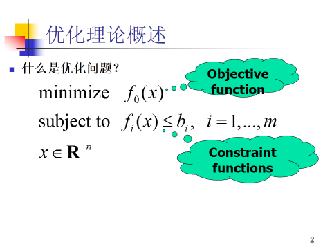
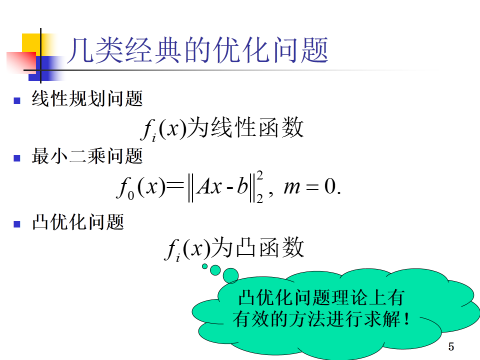

###大家好，
        附件分别是老于昨天的模式识别概述，以及昨天我提到的凸优化理论。
        模式识别无非就是建模、训练、测试（下面是一些我的个人理解，让大家巩固一下昨天的成果，乾哥和老于，以及各位新同学都可以补充讨论）：
##	建模  

a)	也可以称为数学建模  
b)	将要解决的聚类、分类、回归问题，用数学语言进行定义和描述  
c)	建模有好坏——潜能如何，性能如何，可实现性如何等  

##	训练  

### 1.模型训练和驯兽差不多，大家体会一下  
###	2.训练的时候，需要寻找合适的准则（模式识别的结果与真实标注结果直接的度量方法） 
  
>		i.	平均误差最小  
>		ii.	平均误差的平方最小
>		iii.	似然度最大
>		iv.	模型之间区分度最高
>		v.	……  
### 3.有了准则之后，就要定义目标函数，然后通过梯度下降算法、EM算法、牛顿迭代算法等，逼近目标函数的最优解  
  
>		i.	一般情况下我们的目标函数都是凸函数
>		ii.	即使不是凸函数，也经常通过拉格朗日等数学手段，将目标函数等价到一个凸函数
>		iii.	另外，我们的目标函数参数都已不是一维（直线），二维（平面），三维（立体）这样简单可想象函数了，而是几十维，几百维的超平面，超球体，超凸形状  

##	测试：  
a)	用精心挑选的集内和集外数据，对模型进行测试，验证训练效果。  
b)	测试结果中会有一些误差，我们要区分并分析模型误差，训练误差等，从而确保我们建模和训练没有出错。  

